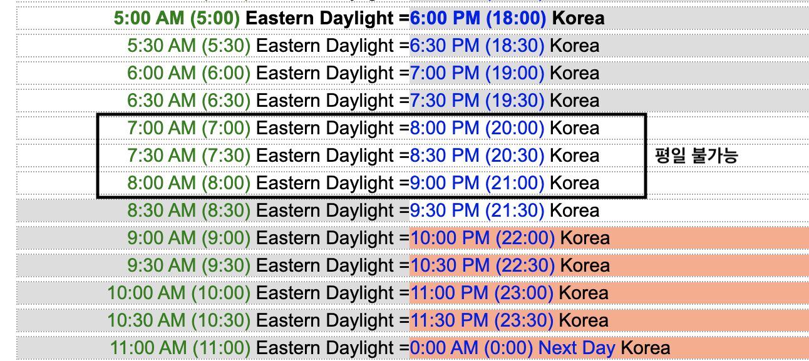
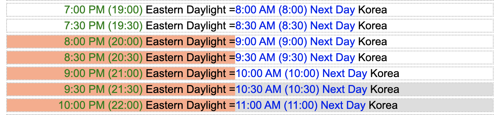

# Data Structure Study

## Members

- rolemadelen (Eastern Daylight Time)
- SeoSeo (Korea Time)

## Topics of Study

- [Singly Linked List](#linked-list)
  - Implement (with/without tail pointer)
    - [x] size()
    - [x] isEmpty()
    - [x] pushFront(value)
    - [x] pushBack(value)
    - [x] popFront()
    - [x] popBack()
    - [x] getFront()
    - [x] getBack()
    - [x] reverse()
    - [x] insert(index, value) - 0-based index
  - [x] Know the time complexity for each methods
  - [x] Know the difference between Singly, Doubly and Circular Linked List
  - [x] Know when to use Linked Lists and Arrays
- [Stack](#stack) | [issue](https://github.com/rolemadelen/madelenrissa/issues/2)
  - Implement using Linked List
    - [x] top()
    - [x] isEmpty()
    - [x] push(value)
    - [x] pop()
  - [x] Know the time complexity for each methods
- [Queue](#queue) | [issue](https://github.com/rolemadelen/madelenrissa/issues/3)
  - Implement using Linked List
    - [x] getFront()
    - [x] getRear()
    - [x] enqueue(value)
    - [x] dequeue()
  - Implement using fixed-size array
    - [x] getFront()
    - [x] getRear()
    - [x] isEmpty()
    - [x] isFull()
    - [x] enqueue(value)
    - [x] dequeue()
    - [x] What's the limitation of Queue implemented with a fixed-size array?
  - [x] Know the time complexity for each methods
- Tree
  - [x] [Intro to Trees (video)](https://www.coursera.org/lecture/data-structures/trees-95qda)
  - [x] [Tree Traversal (video)](https://www.coursera.org/lecture/data-structures/tree-traversal-fr51b)
    - Inorder
    - Preorder
    - Postorder
  - [x] Understand BFS (Breadth First Search)
  - [x] Understand DFS (Depth First Serach)
- Binary Search Tree (BST)
  - Implement
    - [x] insert(value)
    - DFS
      - [x] inorder()
      - [x] preorder()
      - [x] postorder()
    - [x] getMin()
    - [x] getMax()
    - [x] bfs() -- print values in level order
    - [x] existInTree(value)
- Heap
  - [ ] Implement MinHeap
  - [ ] Implement MaxHeap
- Priority Queue
  - TBD
- Graph
  - Adjacency List
  - Adjacency Matrix
  - TBD

---

## Problems

### Linked List

|       #       | Problem                                           | Difficulty |
| :-----------: | :------------------------------------------------ | :--------- |
|    [2][i2]    | Add Two Numbers                                   | Medium     |
|   [19][i19]   | Remove Nth Node From End of List                  | Medium     |
|   [21][i21]   | Merge Two Sorted Lists                            | Easy       |
|   [23][i23]   | Merge k Sorted Lists                              | Hard       |
|   [83][i83]   | Remove Duplicates from Sorted List                | Easy       |
|  [141][i141]  | Linked List Cycle                                 | Easy       |
|  [146][i146]  | LRU Cache                                         | Medium     |
|  [160][i160]  | Intersection of Two Linked Lists                  | Easy       |
|  [203][i203]  | Remove Linked List Elements                       | Easy       |
|  [206][i206]  | Reverse Linked List                               | Easy       |
|  [234][i234]  | Palindrome Linked List                            | Easy       |
|  [237][i237]  | Delete Node in a Linked List                      | Easy       |
|  [432][i432]  | All O`one Data Structure                          | Hard       |
|  [876][i876]  | Middle of the Linked List                         | Easy       |
| [1206][i1206] | Convert Binary Number in a Linked List to Integer | Easy       |
| [1290][i1290] | Design Skiplist                                   | Hard       |
| [1669][i1669] | Merge In Between Linked Lists                     | Medium     |
| [2181][i2181] | Merge Nodes in Between Zeros                      | Medium     |

[i2]: https://leetcode.com/problems/add-two-numbers/
[i19]: https://leetcode.com/problems/remove-nth-node-from-end-of-list/
[i21]: https://leetcode.com/problems/merge-two-sorted-lists/
[i23]: https://leetcode.com/problems/merge-k-sorted-lists/
[i83]: https://leetcode.com/problems/remove-duplicates-from-sorted-list/
[i141]: https://leetcode.com/problems/linked-list-cycle/
[i146]: https://leetcode.com/problems/lru-cache/
[i160]: https://leetcode.com/problems/intersection-of-two-linked-lists/
[i203]: https://leetcode.com/problems/remove-linked-list-elements/
[i206]: https://leetcode.com/problems/reverse-linked-list/
[i234]: https://leetcode.com/problems/palindrome-linked-list/
[i237]: https://leetcode.com/problems/delete-node-in-a-linked-list/
[i432]: https://leetcode.com/problems/all-oone-data-structure/
[i876]: https://leetcode.com/problems/middle-of-the-linked-list/
[i1206]: https://leetcode.com/problems/convert-binary-number-in-a-linked-list-to-integer/
[i1290]: https://leetcode.com/problems/design-skiplist/
[i1669]: https://leetcode.com/problems/merge-in-between-linked-lists/
[i2181]: https://leetcode.com/problems/merge-nodes-in-between-zeros/

### Stack

|       #       | Problem                                              | Difficulty |
| :-----------: | :--------------------------------------------------- | :--------- |
|   [20][i20]   | Valid Parentheses                                    | Easy       |
|  [232][i232]  | Implement Queue using Stacks                         | Easy       |
|  [234][i234]  | Palindrome Linked List                               | Easy       |
| [1021][i1021] | Remove Outermost Parentheses                         | Easy       |
| [1047][i1047] | Remove All Adjacent Duplicates In String             | Easy       |
| [1614][i1614] | Maximum Nesting Depth of the Parentheses             | Easy       |
|  [173][i173]  | Binary Search Tree Iterator                          | Medium     |
|  [654][i654]  | Maximum Binary Tree                                  | Medium     |
|  [946][i946]  | Validate Stack Sequences                             | Medium     |
| [1008][i1008] | Construct Binary Search Tree from Preorder Traversal | Medium     |
| [1381][i1381] | Design a Stack With Increment Operation              | Medium     |
| [1441][i1441] | Build an Array With Stack Operations                 | Medium     |
| [1472][i1472] | Design Browser History                               | Medium     |
| [2130][i2130] | Maximum Twin Sum of a Linked List                    | Medium     |
|  [726][i726]  | Number of Atoms                                      | Hard       |
|  [736][i736]  | Parse Lisp Expression                                | Hard       |
|  [895][i895]  | Maximum Frequency Stack                              | Hard       |
| [1944][i1944] | Number of Visible People in a Queue                  | Hard       |

[i20]: https://leetcode.com/problems/valid-parentheses/
[i232]: https://leetcode.com/problems/implement-queue-using-stacks/
[i234]: https://leetcode.com/problems/palindrome-linked-list/
[i1021]: https://leetcode.com/problems/remove-outermost-parentheses/
[i1047]: https://leetcode.com/problems/remove-all-adjacent-duplicates-in-string/
[i1614]: https://leetcode.com/problems/maximum-nesting-depth-of-the-parentheses/
[i173]: https://leetcode.com/problems/binary-search-tree-iterator/
[i654]: https://leetcode.com/problems/maximum-binary-tree/
[i946]: https://leetcode.com/problems/validate-stack-sequences/
[i1008]: https://leetcode.com/problems/construct-binary-search-tree-from-preorder-traversal/
[i1381]: https://leetcode.com/problems/design-a-stack-with-increment-operation/
[i1441]: https://leetcode.com/problems/build-an-array-with-stack-operations/
[i1472]: https://leetcode.com/problems/design-browser-history/
[i2130]: https://leetcode.com/problems/maximum-twin-sum-of-a-linked-list/
[i726]: https://leetcode.com/problems/number-of-atoms/
[i736]: https://leetcode.com/problems/parse-lisp-expression/
[i895]: https://leetcode.com/problems/maximum-frequency-stack/
[i1944]: https://leetcode.com/problems/number-of-visible-people-in-a-queue/

### Queue

|       #       | Problem                                | Difficulty |
| :-----------: | :------------------------------------- | :--------- |
|  [225][i225]  | Implement Stack using Queues           | Easy       |
|  [933][i933]  | Number of Recent Calls                 | Easy       |
| [1700][i1700] | Number of Students Unable to Eat Lunch | Easy       |
|  [950][i950]  | Reveal Cards In Increasing Order       | Medium     |
| [1670][i1670] | Design Front Middle Back Queue         | Medium     |
| [1823][i1823] | Find the Winner of the Circular Game   | Medium     |
| [2327][i2327] | Number of People Aware of a Secret     | Medium     |
|  [239][i239]  | Sliding Window Maximum                 | Hard       |
|  [936][i936]  | Stamping The Sequence                  | Hard       |
| [2444][i2444] | Count Subarrays With Fixed Bounds      | Hard       |

[i225]: https://leetcode.com/problems/implement-stack-using-queues/
[i933]: https://leetcode.com/problems/number-of-recent-calls/
[i1700]: https://leetcode.com/problems/number-of-students-unable-to-eat-lunch/
[i950]: https://leetcode.com/problems/reveal-cards-in-increasing-order/
[i1670]: https://leetcode.com/problems/design-front-middle-back-queue/
[i1823]: https://leetcode.com/problems/find-the-winner-of-the-circular-game/
[i2327]: https://leetcode.com/problems/number-of-people-aware-of-a-secret/
[i239]: https://leetcode.com/problems/sliding-window-maximum/
[i936]: https://leetcode.com/problems/stamping-the-sequence/
[i2444]: https://leetcode.com/problems/count-subarrays-with-fixed-bounds/
