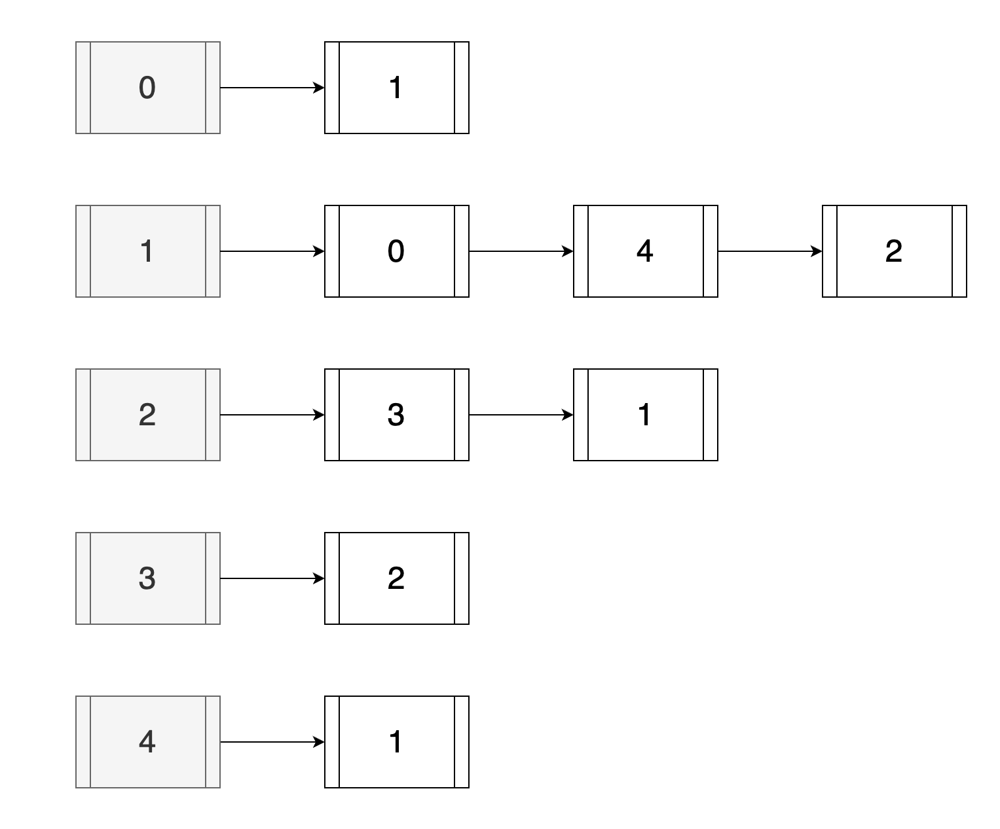

# Adjacency List

A graph can be represented using a collection of linked lists.



Each linked list is a vertex (`u`) on its own and their nodes represent connected vertices (`v`).

## Pseudocode for Basic Operations

### addEdge

```text
addEdge(graph, u, v, weight = 1)
    Pre: 'graph' is a 2d number type array,
         'u' and 'v' is an ordered pair vertices.
    Post: an edge is created between 'u' and 'v'

    graph[u].push_back(v);
    graph[v].push_back(u);

END addEdge
```

### removeEdge

```text
removeEdge(graph, u, v, weight = 1)
    Pre: 'graph' is a 2d number type array,
         'u' and 'v' is an ordered pair vertices.
    Post: an edge connecting 'u' and 'v' is removed.

    node ← graph[u].find(v);
    IF (node != ø)
        graph[u].remove(node);
    END IF

    node ← graph[v].find(u);
    IF (node != ø)
        graph[v].remove(node);
    END I

END removeEdge
```