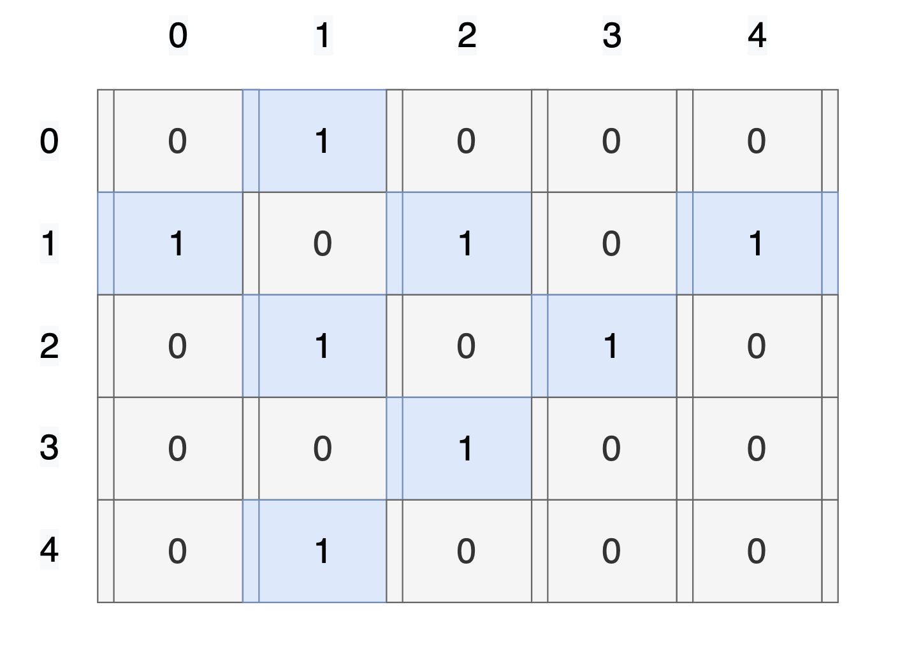

# Adjacency Matrix

A graph can be represented in a form 2-Dimensional matrix.



Rows and columns represent vertices and the element of that index (`[u][v]`) is a weight or the cost of traversing from vertex `u` to vertex `v`.

For _unweighted_ graph, a true value (`1`, `true`, etc...) denotes that there's an edge between `u` and `v` and any false value to represent that there's no edge between two nodes `u` and `v`.

## Pseudocode for Basic Operations

### addEdge

```text
addEdge(graph, u, v, weight = 1)
    Pre: 'graph' is a 2d number type array,
         'u' and 'v' is an ordered pair vertices.
    Post: an edge is created between 'u' and 'v'

    graph[u][v] ← weight;
    graph[v][u] ← weight;

END addEdge
```

### removeEdge

```text
removeEdge(graph, u, v, weight = 1)
    Pre: 'graph' is a 2d number type array,
         'u' and 'v' is an ordered pair vertices.
    Post: an edge connecting 'u' and 'v' is removed.

    graph[u][v] ← ø;
    graph[v][u] ← ø;

END removeEdge
```