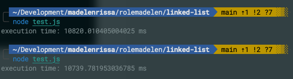
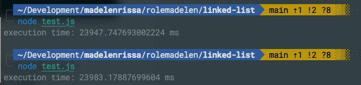

# Singly Linked List

- Implement
- [x] without tail pointer
- [x] with tail pointer
- [x] size()
- [x] isEmpty()
- [x] pushFront(value)
- [x] pushBack(value)
- [x] popFront()
- [x] popBack()
- [x] getFront()
- [x] getBack()
- [x] reverse()
- [x] insert(index, value) - 0-based index
- [x] Know the time complexity for each methods
- [x] Know the difference between Singly, Doubly and Circular Linked List
  - Singly -> linear
  - Doubly -> a node with 2 pointers: next and previous nodes. It consumes relatively more memory than a Singly linked list because of extra pointer. But it's easier to traverse through the list.
  - Circular -> can be either Singly or Doubly. Last node links back to the first node and vice versa.
- [x] Know when to use Linked Lists and Arrays
  - Linked List -> linear access time, but its insert and delete operations are performed in constant time.
  - Array -> allows for constant time access to elements, but inserting and deleting elements in between can be expensive due to shifting of elements.

## Perforamnce

When performing 100,000 `pushBack` and `popBack` operations, the average execution time
was approximately 20 seconds for the linked list without a tail pointer. In contrast,
the linked list with a tail pointer achieved an execution time of around 10 seconds.

With a tail pointer:

Without the tail pointer:

